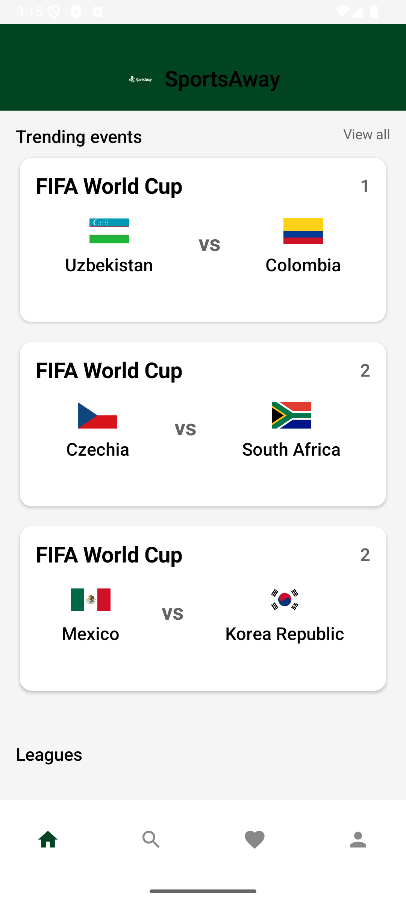
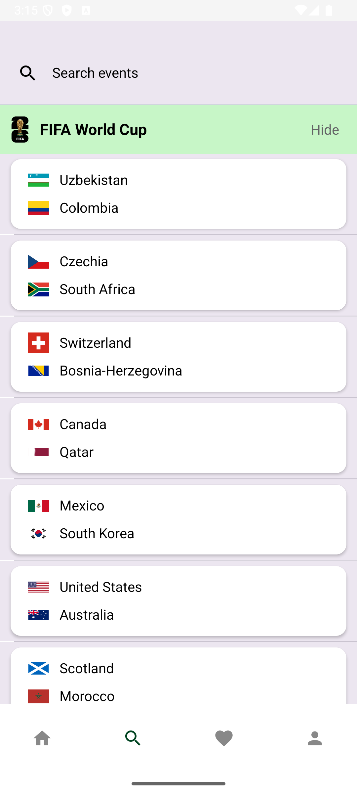
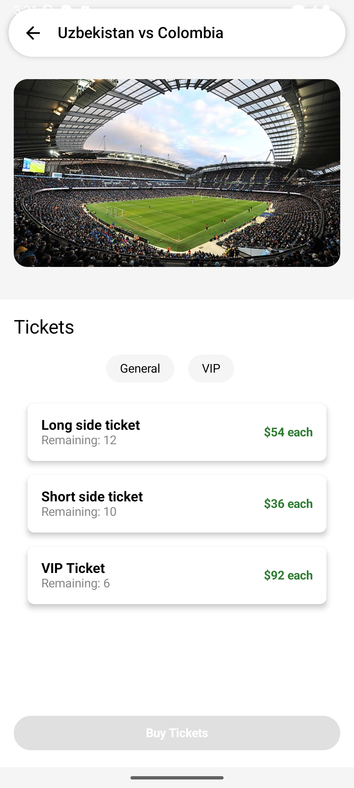
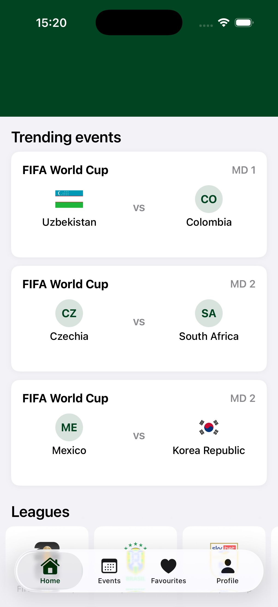
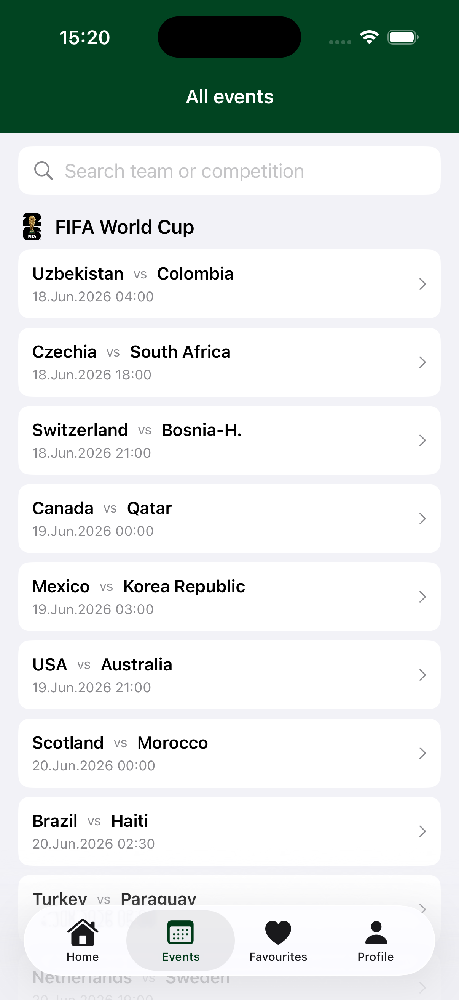
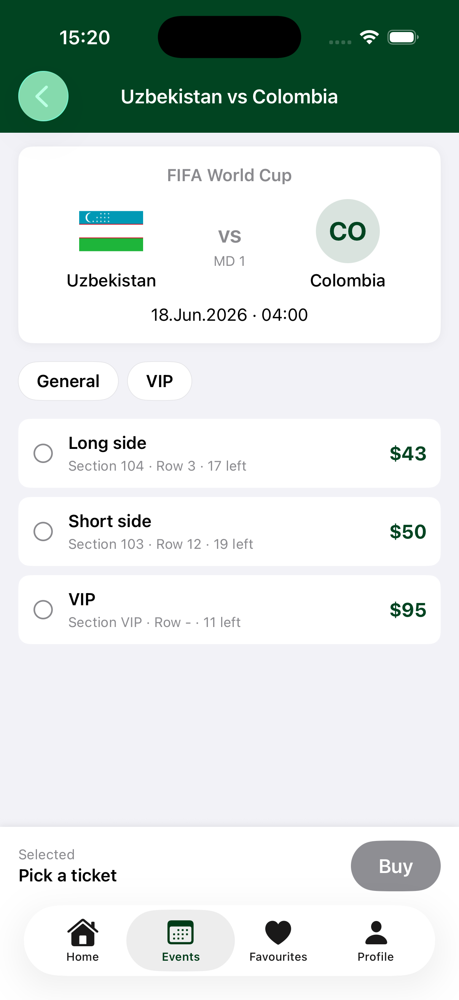

# SportsAway

A cross-platform football ticketing app built with Kotlin Multiplatform. Browse upcoming matches, follow your favourite teams, and book tickets — same shared logic on Android and iOS, native UI on each.

## Architecture

```
SportsAway/
├── shared/                 Kotlin Multiplatform module (commonMain + androidMain + iosMain)
│   ├── data/               Repositories, network (Ktor), models
│   ├── feature/            Feature ViewModels + use cases (dashboard, events, profile, …)
│   └── di/                 Koin modules (data, domain, platform, per-feature)
├── app/                    Android app — Jetpack Compose
└── iosApp/                 iOS app — SwiftUI, consumes Shared.framework
```

The shared module exposes ViewModels that hold `StateFlow` / `SharedFlow`. Android collects them with `collectAsState`; iOS bridges them through `FlowObserver` into Combine `@Published` properties so SwiftUI can observe.

## Features

- **Home** — trending matches + a competition picker (World Cup first during international windows).
- **Events** — matches grouped by competition, with a search field.
- **Event details** — match header, General / VIP ticket filter, ticket list, buy flow.
- **Order tickets** — count stepper, payment + billing stub, success state.
- **Favourites** — sign-in gate, team picker, per-team upcoming matches, team news.
- **Profile** — username, upcoming and visited tickets, logout.
- **Sign in / Sign up** — shared validation, server-style error handling.

## Tech stack

| Layer        | Library                                              |
|--------------|------------------------------------------------------|
| Multiplatform| Kotlin 2.0.21, KMP                                   |
| Async        | kotlinx.coroutines 1.9.0, Flow                       |
| Networking   | Ktor 3.0.3 (OkHttp engine on Android, Darwin on iOS) |
| Serialization| kotlinx.serialization 1.7.3                          |
| DI           | Koin 4.0.0                                           |
| Android UI   | Jetpack Compose (BOM 2024.10.01), Material 3         |
| iOS UI       | SwiftUI                                              |
| Auth         | Firebase Auth on Android, in-memory stub on iOS      |
| Data source  | [football-data.org](https://www.football-data.org/) v4 API |

## Running

### Android

1. Open the project in Android Studio (Koala or newer).
2. Set `local.properties` if needed (SDK location).
3. Run the `app` configuration on a device or emulator (`minSdk 29`).

### iOS

1. Build the shared framework from the project root:
   ```sh
   ./gradlew :shared:embedAndSignAppleFrameworkForXcode
   ```
   (Xcode also runs this on build via a Run Script phase.)
2. Open `iosApp/iosApp/iosApp.xcodeproj` in Xcode 15+.
3. Add `iosApp/iosApp/iosApp/Resources/teaminfo.json` to the target if Xcode hasn't picked it up (right-click `iosApp` group → "Add Files to iosApp…").
4. Run on a simulator (iOS 17+).

## Notes

- The football-data.org free tier caps match queries at 10-day windows. `SportsEventsRepositoryImpl.probeForUpcomingMatches` probes forward in 10-day chunks so the app keeps showing data during off-season.
- Team crests from the API are mostly SVG. iOS can't decode SVG natively, so it falls back to a branded initials badge instead of a broken-image icon. PNG competition emblems render normally via `AsyncImage`.
- iOS uses an in-memory `StubAuthRepository` — accounts live for the lifetime of the process. Swap for a real Firebase implementation before shipping iOS.

## Screenshots

Add captures into `docs/screenshots/android/` and `docs/screenshots/ios/`. The README references them by name below; renaming them will break the layout.

### Android

| Home | Events | Event details | Profile |
|------|--------|---------------|---------|
|  |  | 

### iOS

| Home | Events | Event details                                      | Profile |
|------|--------|----------------------------------------------------|---------|
|  |  | 
